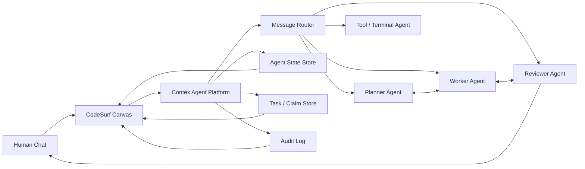

# Contex Agent Platform Upgrade

日期：2026-06-28  
状态：设计文档 / 可执行开发入口  
范围：Contex Agent 平台能力、CodeSurf 可视化编排、Codex Agent Runtime 升级

## 背景

当前 CodeSurf 中的 `Codex Agent` terminal tile 实际运行的是：

```sh
node CodeSurf/scripts/codex-chat-agent.mjs
```

这个脚本不是 Codex 模型本体，也不是最终形态的 Agent 平台。它是一个临时但有效的
Agent runtime adapter：负责注册到 Contex、读取 Human Chat 消息、调用 `codex exec`、
再把最终回复发回 Contex。

这个设计作为 MVP 合理，因为 browser 里的 terminal tile 是 piped stdio，没有真实 TTY，
交互式 `codex` TUI 无法稳定运行。但如果目标是让多个 Agent 自主沟通、协作、汇报状态，
则需要把 Agent 身份、状态、通信、任务协调沉到 Contex；CodeSurf 负责可视化编排和观察。

## 目标

Contex 成为本地 Agent 平台：

- 管理 Agent 身份、能力、状态、消息、任务和协作关系。
- 支持多个 Agent 互相发送消息、请求协助、交接任务、汇总结果。
- 提供可审计的消息流、任务流、状态流。
- 不绑定具体 runtime；Codex、shell、Node script、未来的 Claude/自定义 worker 都只是 adapter。

CodeSurf 成为 Agent 工作流编排界面：

- 用户可以创建多个 Agent tile。
- 用户可以通过连线安排 Agent 之间的通信方式。
- 用户可以看到每个 Agent 的状态、当前任务、最近消息、输出结果。
- 用户可以手动启动、停止、重启、改角色、改 prompt、改模型。
- 用户可以设计一对一、主管-成员、广播、流水线、评审链等协作模式。

## 当前设计判断

### 现在的 terminal bridge 是否合理

合理，但应该重新命名和定位。

当前 `CodeSurf/scripts/codex-chat-agent.mjs` 应被视为：

```text
Codex Runtime Adapter
```

而不是 Agent 平台本身。

它目前承担了三类职责：

1. Runtime：调用 `codex exec`。
2. Transport：通过 Contex 收发消息。
3. Agent loop：轮询 inbox，并处理消息。

短期可以保留这份脚本；中期应升级成通用 runtime：

```text
CodeSurf/scripts/agent-runtime-codex.mjs
```

并让它从 Agent profile 中读取 role、model、system prompt、tools、工作目录等配置。

## 目标架构



## 核心概念

### Agent

Agent 是 Contex 中的协作者身份，不等于 CodeSurf tile，也不等于一个 terminal 进程。

建议字段：

```json
{
  "agent_id": "agent_planner",
  "tile_id": "tile_planner",
  "runtime": "codex",
  "role": "planner",
  "display_name": "Planner Agent",
  "capabilities": ["chat", "planning", "handoff"],
  "status": "idle",
  "task": "Waiting for work",
  "summary": "Ready",
  "updated_at": "2026-06-28T00:00:00.000Z"
}
```

### Agent Profile

Agent profile 是 CodeSurf/Contex 共同理解的配置：

```json
{
  "runtime": "codex",
  "model": "gpt-5.5",
  "role": "reviewer",
  "system_prompt": "你负责审查实现风险、测试缺口和架构一致性。",
  "cwd": "/Users/sking/project/tiny-world-builder",
  "tools": ["shell.read", "git.diff", "contex.message"],
  "auto_start": true
}
```

### Link

CodeSurf 里的连线应该同步为 Contex 的通信规则。

常见模式：

- `human -> planner`：用户把目标交给 Planner。
- `planner -> worker`：Planner 分派实现任务。
- `worker -> reviewer`：Worker 请求 review。
- `reviewer -> planner`：Reviewer 返回风险和建议。
- `planner -> human`：Planner 汇总最终状态。

### Coordinator

Coordinator 是一个可选 Agent，可以是普通 Agent 的特殊 role，也可以是 Contex 内置策略。

第一阶段建议先用普通 Agent 实现：

```json
{
  "role": "coordinator",
  "capabilities": ["chat", "planning", "task_assignment", "summarize"]
}
```

## Contex 协议升级

### 最小工具集

现有 Contex 已有 `peer_set_state`、`peer_send_message`、`peer_read_messages`、
`link_tiles` 等能力。Agent 平台升级可以先在这些能力上包一层语义化 API。

建议新增或规范化：

```text
agent_register
agent_update_state
agent_list
agent_send_message
agent_read_messages
agent_claim_task
agent_complete_task
agent_request_handoff
agent_broadcast
```

### agent_register

用途：注册 Agent 身份、runtime、role、capabilities。

输入：

```json
{
  "agent_id": "agent_worker_1",
  "tile_id": "terminal_worker_1",
  "runtime": "codex",
  "role": "worker",
  "display_name": "Worker 1",
  "capabilities": ["chat", "code_edit", "terminal"]
}
```

### agent_update_state

用途：让 CodeSurf 实时展示 Agent 状态。

输入：

```json
{
  "agent_id": "agent_worker_1",
  "status": "working",
  "task": "Implement Contex agent message router",
  "summary": "Editing domain messaging and tool schema",
  "needs": []
}
```

状态建议：

```text
idle
working
waiting
blocked
reviewing
done
error
offline
```

### agent_send_message

用途：Agent 对 Agent、Agent 对 Human、Human 对 Agent 的统一消息接口。

输入：

```json
{
  "from_agent_id": "agent_planner",
  "to_agent_id": "agent_worker_1",
  "text": "请实现 agent_register 和 agent_update_state 的工具 schema。",
  "priority": "normal",
  "thread_id": "task_agent_platform_phase_1"
}
```

### agent_broadcast

用途：按 link、role、capability 广播消息。

示例：

```json
{
  "from_agent_id": "agent_coordinator",
  "selector": {
    "role": "reviewer"
  },
  "text": "请审查当前 Agent Platform 升级方案的风险。"
}
```

### agent_claim_task / agent_complete_task

用途：避免多个 Agent 同时做同一件事。

建议任务字段：

```json
{
  "task_id": "task_agent_protocol",
  "title": "Define Agent Protocol",
  "status": "claimed",
  "claimed_by": "agent_worker_1",
  "objective_id": "objective_agent_platform"
}
```

## CodeSurf UI 升级

### Create Agent 面板

新增用户入口：

- Runtime：Codex / Shell / Node Script / Custom
- Role：Coordinator / Planner / Worker / Reviewer / Researcher
- Model
- System Prompt
- Working Directory
- Auto Start
- Capabilities

创建后 CodeSurf 生成：

- Agent tile
- Runtime terminal tile 或隐藏 runtime process
- Agent profile
- Contex registration

### Agent Tile

Agent tile 展示：

- display name
- role
- runtime
- status
- current task
- latest summary
- last message time
- start / stop / restart

### Communication View

CodeSurf 的连线不只是视觉关系，而是通信策略：

- directed link：只允许 source 给 target 发消息。
- undirected link：双方可互发。
- group link：广播给一组 Agent。
- report link：下游完成后汇报给上游。

### Human 可控的协作方式

用户可以手动搭：

```text
Human Chat -> Coordinator -> Planner -> Worker -> Reviewer -> Human Chat
```

也可以搭：

```text
Human Chat -> Worker A
Human Chat -> Worker B
Worker A -> Reviewer
Worker B -> Reviewer
Reviewer -> Human Chat
```

## Runtime Adapter 升级

当前：

```text
CodeSurf/scripts/codex-chat-agent.mjs
```

建议演进为：

```text
CodeSurf/scripts/agent-runtime-codex.mjs
```

职责：

- 从环境变量或 profile 文件读取 agent 配置。
- 注册 Agent。
- 根据 Contex links 或 inbox 收消息。
- 调用 `codex exec`。
- 把最终回答写回 Contex。
- 周期性更新状态。
- 支持 task claim / complete。

建议环境变量：

```text
CONTEX_URL
CONTEX_TOKEN
CONTEX_WORKSPACE
AGENT_ID
AGENT_TILE_ID
AGENT_PROFILE_JSON
AGENT_ROLE
AGENT_MODEL
AGENT_SYSTEM_PROMPT
AGENT_CWD
```

## 分阶段实施计划

### Phase 1：文档和协议边界

状态：已完成。可执行接力文件见 `AGENT_PLATFORM_PHASE1.md`。

目标：

- 明确 Contex 是 Agent 平台。
- 明确 CodeSurf 是可视化编排层。
- 明确 runtime adapter 不是 Agent 平台本身。

产出：

- 本文档。
- `AGENT_PLATFORM_PHASE1.md`：Phase 1 决策、现有 primitive 映射、Phase 2
  `agent_*` API 接力清单。
- 现有 `codex-chat-agent.mjs` 保留为 MVP bridge。

完成标准：

- 文档可作为换窗口后的上下文恢复入口。
- 后续开发者可以从 `AGENT_PLATFORM_PHASE1.md` 直接进入 Phase 2，不需要重读
  CodeSurf/Contex 全部历史。

### Phase 2：Contex Agent 语义 API

状态：已完成。

目标：

- 在 Contex tools 中增加 agent_* 语义工具。
- 先复用现有 peer/message/link/task 数据结构，减少数据库改动。

建议改动：

- `Contex/src/tools.mjs`
- `Contex/src/index.mjs`
- 可能新增 `Contex/src/domain/agents.mjs`
- 增加 tests：`Contex/test/agents.test.mjs`

完成标准：

- `agent_register`
- `agent_update_state`
- `agent_send_message`
- `agent_read_messages`
- `agent_list`

实现说明：

- 新增 `Contex/src/domain/agents.mjs`，把 Agent 语义映射到现有 `tile`
  行，不新增表结构。
- `role` / `runtime` 使用稳定 capability marker 保存：`agent`、
  `role:<role>`、`runtime:<runtime>`。
- `agent_send_message` 复用现有 message inbox，并遵守 directed link 的
  source → target 方向。
- 新增 `Contex/test/agents.test.mjs` 覆盖注册、状态更新、列表过滤、消息、
  directed link 和 MCP tool catalog。

### Phase 3：Codex Runtime Adapter 通用化

状态：已完成。

目标：

- 把 `codex-chat-agent.mjs` 提升为通用 `agent-runtime-codex.mjs`。
- 支持 role/system prompt/model/profile。

建议改动：

- 新增 `CodeSurf/scripts/agent-runtime-codex.mjs`
- 兼容旧脚本，或让旧脚本转发到新脚本。

完成标准：

- 可以启动多个 Codex Agent，使用不同 `AGENT_ID` 和 role。
- 多个 Agent 能通过 Contex 互相发消息。

实现说明：

- 新增 `CodeSurf/scripts/agent-runtime-codex.mjs`。
- `CodeSurf/scripts/codex-chat-agent.mjs` 保留为兼容入口，转发到新 runtime。
- 新 runtime 支持：
  - `AGENT_ID`
  - `AGENT_TILE_ID`
  - `AGENT_PROFILE_JSON`
  - `AGENT_ROLE`
  - `AGENT_MODEL`
  - `AGENT_SYSTEM_PROMPT`
  - `AGENT_CWD`
  - legacy `CARD_ID` / `CODEX_CHAT_MODEL`
- Runtime 使用 Phase 2 的 `agent_register`、`agent_update_state`、
  `agent_read_messages`、`agent_send_message`。
- 新增 `CodeSurf/test/agent-runtime-codex.test.mjs` 覆盖 profile/env 解析和
  Codex prompt 组装。

### Shared local tooling note

Playwright is installed locally at `/Users/sking/codeSurf`, not globally. Use
`npm --prefix /Users/sking/codeSurf exec playwright -- ...` or import from
`/Users/sking/codeSurf/node_modules` when a browser check needs Playwright.

### Phase 4：CodeSurf Create Agent UI

状态：已完成。

目标：

- 用户可在 CodeSurf 中创建 Agent。
- 用户可选择 runtime、role、model、prompt。

建议改动：

- `CodeSurf/public/index.html`
- `CodeSurf/public/canvas.js`
- `CodeSurf/public/tiles.mjs`
- `CodeSurf/src/store.mjs`

完成标准：

- 创建 Agent tile 后自动注册到 Contex。
- 可启动/停止 runtime。
- 状态显示正常。

实现说明：

- CodeSurf 新增 `+ Agent` 入口和 Create Agent 对话框。
- 新增 CodeSurf `agent` tile 类型，展示 role/runtime/model 摘要并复用
  terminal runtime surface 的 start/stop/stream 控制。
- 新增 `/api/agent-runtimes/codex`，由服务端返回本机
  `agent-runtime-codex.mjs` 的实际路径，避免前端硬编码绝对路径。
- Terminal start endpoint 支持 per-Agent `env`，用于传入
  `AGENT_PROFILE_JSON`、`AGENT_ID`、`AGENT_ROLE`、`AGENT_MODEL` 等。
- 创建 Agent 时生成持久化 tile data：runtime command、cwd、profile、env、
  auto-start 设置。
- 使用 `/Users/sking/codeSurf` 中的本地 Playwright 验证了真实页面创建
  Agent tile、保存 profile/env、runtime command 指向 Phase 3 adapter。

### Phase 5：Agent 协作模式

状态：已完成（2026-06-28）

落地能力：

- `agent_claim_task`：Agent 领取 open/assigned task，并可进入 `in_progress`。
- `agent_complete_task`：按现有 task 生命周期推进到 `done`，记录 result summary。
- `agent_request_handoff`：Worker/Planner 将 task ownership 交给 Reviewer/其他 Agent，并发送需确认消息。
- `agent_report`：Reviewer/Worker 回报 Coordinator 或 Human-facing tile，可同步 task summary。
- `agent_broadcast`：按 role/runtime/status/capability 选择 Agent，并保持 link-gated 投递策略。

完成标准：

- 用户给 Coordinator 一个目标后，可创建 task 并分配给 Worker。
- Worker 可 claim/start task，也可 handoff 给 Reviewer。
- Reviewer 可 report 给 Coordinator 或 Human。
- 未连线的 broadcast recipient 不会被绕过权限；结果中显示 delivery failure。

实现位置：

- `Contex/src/domain/agents.mjs`
- `Contex/src/index.mjs`
- `Contex/src/tools.mjs`
- `Contex/test/agents.test.mjs`

### Phase 6：可观测性和审计

状态：已完成（2026-06-28）

落地能力：

- `context://workspace/{workspaceId}/timeline`：workspace-wide Agent collaboration timeline。
- `context://tile/{tileId}/timeline`：单 Agent/tile 的状态、消息、任务 timeline。
- `get_workspace_timeline`：MCP tool，返回规范化 workspace timeline。
- `get_agent_timeline`：MCP tool，返回规范化 Agent/tile timeline。
- `listTimeline`：Contex facade/store 层聚合 audit events，输出 `category`、`summary`、`payload`。
- task audit payload 增强，记录 owner/status/result summary，便于从 audit 重建协作上下文。

完成标准：

- 可查看 Agent timeline。
- 可查看 workspace timeline。
- 可从 audit 重建关键状态、消息、任务事件。
- 既保留原始 audit payload，也给 UI 提供稳定分类和摘要。

实现位置：

- `Contex/src/store.mjs`
- `Contex/src/resources.mjs`
- `Contex/src/tools.mjs`
- `Contex/src/index.mjs`
- `Contex/src/domain/tasks.mjs`
- `Contex/test/agents.test.mjs`

### Human Handoff：权限/重大决策等待人类接入

状态：已完成（2026-06-28）

目标：

- 各 Agent 可以独立运行。
- Agent 之间通过 Contex link-gated message 相互交流。
- Agent 遇到权限问题、凭证缺失、破坏性操作或重大产品决策时，可以停止推进并等待人类。

落地能力：

- `agent_request_human_input`：Agent 将自己置为 `waiting`/`blocked`，写入 blocker，并触发 `human_attention`。
- 关联 task 时可同步 task blocker，便于状态面板和 timeline 解释“卡在哪里”。
- `CodeSurf/scripts/agent-runtime-codex.mjs` 支持模型输出：

```text
HUMAN_ATTENTION: <short question for the human>
HUMAN_ATTENTION[permission]: <short question for the human>
```

- runtime 识别该标记后，不会把它当普通回复继续发送，而是调用 `agent_request_human_input`，并可向上游 Agent report “Waiting for human input”。

完成标准：

- Agent 可独立轮询 inbox 并处理消息。
- Agent 间通信仍由 CodeSurf/Contex links 控制。
- 需要人类时，Agent 进入 waiting/blocked，并通过 `human_attention` 通知 CodeSurf/用户。

## 开发足迹

### 本文档创建时的上下文

用户目标：

> 希望 Contex 可以起到 Agent 平台的作用，可以安排 Agent 自身之间的交流，CodeSurf 可以让用户自主安排交流方式，并看到各自 Agent 的状态。

当前浏览器：

```text
http://127.0.0.1:8742/
```

当前可工作的 MVP：

```text
Human Chat -> terminal_codex_agent
terminal_codex_agent runs: node CodeSurf/scripts/codex-chat-agent.mjs
codex-chat-agent.mjs calls: codex exec
reply returns to Human Chat through Contex
```

最近一次验证：

```text
Human Chat -> Codex Agent delivered successfully
Codex Agent replied: HUMAN_HELLO_OK_0627B
terminal tail had no new "start failed"
terminal tail had no new "429"
```

### 已完成的相关修复

1. `CodeSurf/scripts/codex-chat-agent.mjs`
   - 新增 Codex chat bridge。
   - 使用 `codex exec` 替代交互式 Codex TUI。
   - 使用 `--output-last-message` 提取干净最终回复。
   - 遇到 Contex 429 时退避并降噪。

2. `CodeSurf/public/canvas.js`
   - terminal 已经 running 时复用，不再重复 start。
   - 避免出现 `[start failed: terminal already running]`。

3. `CodeSurf/src/cli.mjs`
   - CodeSurf 内嵌 Contex 默认以 `--rate-limit 0` 启动。
   - 支持通过 `--contex-rate-limit <n>` 覆盖。

### 当前风险和注意事项

- `codex-chat-agent.mjs` 仍是 MVP adapter，不支持多个 Agent profile。
- 多 Agent 场景下，必须为每个 Agent 分配唯一 `AGENT_ID` / tile id。
- 现有 Contex `peer_*` API 能支撑早期实现，但长期需要 `agent_*` 语义层。
- CodeSurf 当前的 link 主要是 canvas 关系，需要升级为可解释的通信策略。
- 如果重新启动 CodeSurf，需要重新确认 terminal agent 已启动并注册到 Contex。

### 下一次开发入口

建议从 Phase 2 开始：

```text
实现 Contex agent_* 语义 API，先复用 peer/message/link 数据结构。
```

推荐第一批文件：

```text
Contex/src/domain/agents.mjs
Contex/src/tools.mjs
Contex/src/index.mjs
Contex/test/agents.test.mjs
```

推荐第一批工具：

```text
agent_register
agent_update_state
agent_list
agent_send_message
agent_read_messages
```

推荐验证：

```sh
npm --prefix Contex test
node --check CodeSurf/scripts/codex-chat-agent.mjs
node --check CodeSurf/public/canvas.js
node --check CodeSurf/src/cli.mjs
```

### 给后续 Codex 的接力提示

如果从新窗口继续，请先读：

```text
Contex/AGENT_PLATFORM_UPGRADE.md
CodeSurf/scripts/codex-chat-agent.mjs
CodeSurf/public/canvas.js
CodeSurf/src/cli.mjs
Contex/src/tools.mjs
Contex/src/index.mjs
Contex/src/domain/messaging.mjs
Contex/src/domain/tiles.mjs
Contex/src/domain/links.mjs
```

然后执行：

```text
Phase 2: add Contex agent_* semantic tools backed by existing peer/message/link primitives.
```
